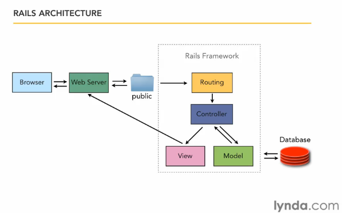

## Workbook - Aaron Kane
# Q1 - Describe the architecture of a typical Rails application

Rails architecture follows the Model-View-Controller(MVC) design pattern where the major components of the application are organised into three layers in order to achieve a "separation of concerns". This separation of concerns increases the application's robustness and testability as each component has no knowledge of the other.

## The model
The model is the application's data structure and has no knowledge of the user interface. It handles the data logic for the rails application. The model layer communicates with the database and makes it available through the controller. The model is typically located in the app/model folder.

## Controller
The controller layer is the mediator between the model and the view and controls the flow of the application. In a typical rails application the controller will query the database and organise it in order to pass it to the view.

## view
The view represents the data to the user. In a rails application this is typically done with embedded ruby or haml. Rails views are typically located in the app/views folders.

## Diagram of a typical rails application

[link to image source](https://i.pinimg.com/originals/6e/f1/8d/6ef18dd3444ddb80c86ffb169bbd6e98.png)

### **Description of the above digram** - 

The browser will send a request to a web server. The web server that is hosting the application will then connect to the routing of the application. The routing engine then communicates with the controller. The controller then communicates with the model in order to pass the data to the view. The view then displays the data and sends it to the web server which then displays it to the browser.

# Q2 - Identify a database management system (DBMS) commonly used in web applications (including Rails) and discuss the pros and cons of this database
Postgresql or simply postgres is a general purpose database management system used worldwide. It was initially release in 1996 and is an open source database system and is used by many different applications. With its' popularity PostgreSQL has gained a large open source support but even with this support there are still some limitations.

## Exploring the PROS - 
- PostgreSQL is scalable and integrates well with multiple applications.
- Open source making it free to use in any applications as well as the ability for developers to work on and improve it.
- PostgreSQL supports JSON
- Has many built in functions to assist with development
- Number of GUI to manage the database such as PGAdmin4
- Support NoSQL

## Exploring the CONS - 
- PostgreSQL being open source can also have downsides. There is no official support and improvements and updates rely on the community. This means if community support diminishes developers will pivot away from using it.
- Speed can be an issue when performing large tasks.
- Slower than other DBMS such as MySQL
- Documentation lacks when compared to other popular DBMS

REFERENCES
https://www.quora.com/Is-PostgreSQL-a-distributed-and-scalable-database
https://www.keycdn.com/blog/popular-databases
https://www.quora.com/What-are-the-advantages-and-disadvantages-of-PostgreSQL

# Q3 - Discuss the implementation of Agile project management methodology
Agile project management is methodology for delivering projects based on iteration. Agile can also be considered a mindset that can respond to ever changing requirements of the project. Using the agile methodology also prioritises user feedback. It favours collaboration with the end user in order to direct the project and iterating based on the feedback. Agile teams focus on collaboration and communication in order to achieve the best results possible. Teams are encouraged to collaborate and iterate based on feedback from eachother as well as customers. In agile teams must establish an MVP(minimum viable product) 

# Q4 - Provide an overview and description of a standard source control workflow

